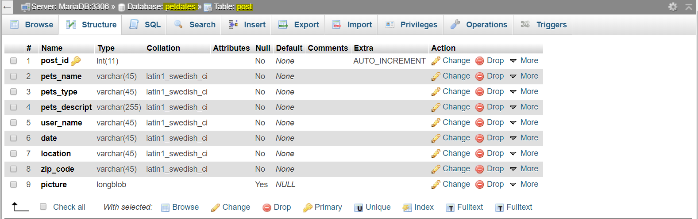

# Pet Play dates
Pet Owners can setup play dates for their pets

Demo on how our website functions and how to use it:  
https://www.youtube.com/watch?v=wLiDKSpH3AQ

First create a database using PHPMyAdmin. The database is called petdates. In the petdates database, we have a table called users which contain the following:

* id - int(11) auto increment
* firstname varchar(100)
* lastname varchar(100)
* phone(10)
* username  -  varchar(100)
* email  -  varchar(100)
* password  -  varchar(100)

We also have a table called post which contain the following:
* post_id - int(11) auto increment
* pets_name varchar(45)
* pets_type varchar(45)
* user_name(45)
* date  -  varchar(45)
* location  -  varchar(45)
* zip_code  -  varchar(45)
* picture - longblob

